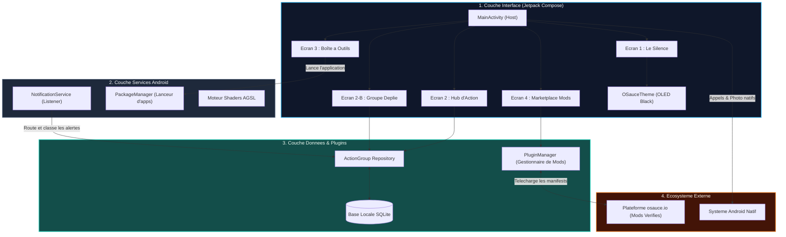

# Architecture Technique OSauce Launcher (Android & Jetpack Compose)

Ce document formalise l'architecture logicielle du Launcher mobile **OSauce**, developpe en **Kotlin** moderne avec **Jetpack Compose**, intégrant la gestion des Groupes d'Action, l'interception des notifications et le Marketplace de modding communautaire.

---

## 1. Diagramme Global des Composants

---

## 2. Description des Couches Logicielles

### 2.1 Couche Présentation (`app/src/main/kotlin/com/osauce/launcher/ui/`)
* **`MainActivity.kt`** : Point d'entrée de l'application déclaré comme `category.HOME` dans le manifest. Gère la machine à états de navigation entre les 4 écrans sans pile de retour encombrée.
* **`SilenceScreen.kt`** : Écran d'accueil épuré avec l'horloge géante, la jauge de batterie sobre et la ligne d'intention unique.
* **`HubScreen.kt`** : Flux des cartes de groupes de vie unifiant alertes, tâches et raccourcis d'outils.
* **`GroupDetailScreen.kt`** : Vue plein écran intérieure d'un groupe avec conversion rapide d'une notification en tâche todo.
* **`ToolsScreen.kt`** : Liste alphabétique monochrome des applications installées avec recherche instantanée.
* **`MarketplaceScreen.kt`** : Vitrine des extensions et mods communautaires certifiés sans pistage ni publicité.

### 2.2 Couche Services Android (`app/src/main/kotlin/com/osauce/launcher/service/`)
* **`NotificationService.kt`** : Hérite de `NotificationListenerService`. Intercepte les notifications du système, élimine les interruptions visuelles et les redirige de manière déterministe vers le bon groupe d'action (`CATEGORY_MESSAGE`, `CATEGORY_TRANSPORT`, `CATEGORY_EMAIL`).
* **Intégration PackageManager** : Interroge les paquets du système sans surcoût mémoire pour lancer les applications d'un geste.

### 2.3 Couche Modding & Données (`app/src/main/kotlin/com/osauce/launcher/plugin/`)
* **`PluginManager.kt`** : Orchestrateur du cycle de vie des mods communautaires. Charge les manifests, active/désactive les extensions et synchronise le catalogue vérifié avec `osauce.io`.
* **Modèles d'Action** : Structures `ActionGroup`, `ActionNotification` et `ActionTodo` découplées assurant une synchronisation fluide avec l'interface.
