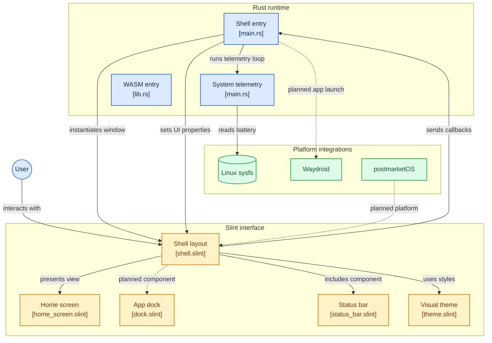

# Architecture Technique OSauce

Ce document formalise l'architecture logicielle du systeme d'exploitation mobile OSauce, decoupee entre le moteur natif Rust, l'interface graphique Slint et les integrations plateformes.

---

## 1. Diagramme Global des Composants

---

## 2. Description des Couches Logicielles

### 2.1 Couche Runtime Rust (`src/`)
- [`src/main.rs`](file:///c:/Users/celestin/OS/src/main.rs) : Point d'entree binaire du simulateur mobile. Il instancie la fenetre Slint (`MainWindow::new()`), enregistre les gestionnaires d'evenements (`on_request_unlock`, `on_request_lock`), demarre la boucle de telemetrie periodique (`slint::Timer`) et interroge le noyau Linux.
- Telemetrie systeme : Fonctions de lecture materielle interrogeant Linux sysfs (`/sys/class/power_supply/*/capacity`, `/sys/class/power_supply/*/status`) et horloge locale via la caisse `chrono`.
- [`src/lib.rs`](file:///c:/Users/celestin/OS/src/lib.rs) : Point d'ancrage exportant le module compile Slint et le point d'entree WebAssembly (`wasm-bindgen`) pour les demonstrations sur le web.

### 2.2 Couche Interface Slint (`ui/`)
- [`ui/shell.slint`](file:///c:/Users/celestin/OS/ui/shell.slint) : Conteneur racine de la fenetre mobile (390x844 px). Il declare les proprietes bidirectionnelles (`in-out property`) et relie la barre de statut et l'ecran d'accueil.
- [`ui/components/status_bar.slint`](file:///c:/Users/celestin/OS/ui/components/status_bar.slint) : Barre d'etat superieure comprenant l'horloge vectorielle, le pourcentage de batterie et l'indicateur d'alimentation.
- [`ui/views/home_screen.slint`](file:///c:/Users/celestin/OS/ui/views/home_screen.slint) : Vue d'accueil et ecran de verrouillage minimaliste gerant la date localisee, le slider de deblocage et les micro-animations tactiles.
- [`ui/styles/theme.slint`](file:///c:/Users/celestin/OS/ui/styles/theme.slint) : Single Source of Truth (SSOT) des constantes visuelles : palette de couleurs, typographie, espacements et arrondis.
- [`ui/components/dock.slint`](file:///c:/Users/celestin/OS/ui/components/dock.slint) : Dock d'applications inferieur (composant reserve pour l'affichage apres deverrouillage).

### 2.3 Couche Plateforme & Systeme
- **Linux sysfs** : Acces bas niveau aux metriques du noyau sans daemon intermediaire.
- **postmarketOS (Cible materielle)** : Distribution Linux basee sur Alpine Linux dediee aux smartphones, fournissant le noyau et Wayland.
- **Waydroid (Compatibilite applicative)** : Conteneur LXC faisant tourner un environnement Android AOSP complet avec rendu GPU partage direct.
