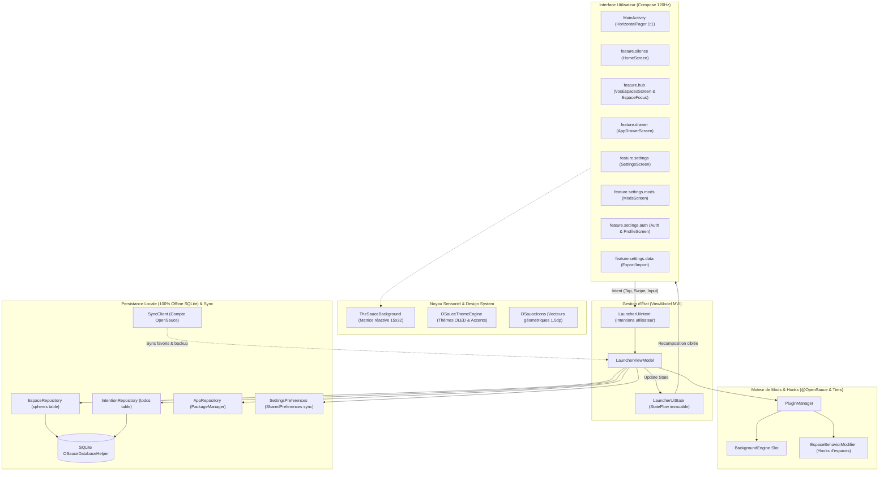

# Architecture Technique OSauce Launcher

Architecture logicielle native Android (Kotlin 2.0 & Jetpack Compose), MVI unidirectionnel, persistance 100% hors-ligne SQLite et moteur de mods ouvert.

---

## 1. Modèle Architectural Global (MVI Unidirectionnel)

```mermaid
flowchart TD
    subgraph UI["Interface Utilisateur (Compose 120Hz)"]
        MainActivity["MainActivity (HorizontalPager 1:1)"]
        Silence["feature.silence (HomeScreen)"]
        Hub["feature.hub (VosEspacesScreen & EspaceFocus)"]
        Drawer["feature.drawer (AppDrawerScreen)"]
        Settings["feature.settings (SettingsScreen)"]
        ModsUI["feature.settings.mods (ModsScreen)"]
        AuthUI["feature.settings.auth (Auth & ProfileScreen)"]
        DataUI["feature.settings.data (Export/Import)"]
    end

    subgraph State["Gestion d'État (ViewModel MVI)"]
        VM["LauncherViewModel"]
        StateFlow["LauncherUiState (StateFlow immuable)"]
        IntentHandler["LauncherUiIntent (Intentions utilisateur)"]
    end

    subgraph Core["Noyau Sensoriel & Design System"]
        TheSauce["TheSauceBackground (Matrice réactive 15x32)"]
        ThemeEngine["OSauceThemeEngine (Thèmes OLED & Accents)"]
        Icons["OSauceIcons (Vecteurs géométriques 1.5dp)"]
    end

    subgraph Modding["Moteur de Mods & Hooks (@OpenSauce & Tiers)"]
        BgEngine["BackgroundEngine Slot"]
        SphereHooks["EspaceBehaviorModifier (Hooks d'espaces)"]
        PluginMgr["PluginManager"]
    end

    subgraph Data["Persistance Locale (100% Offline SQLite) & Sync"]
        SphereRepo["EspaceRepository (spheres table)"]
        TodoRepo["IntentionRepository (todos table)"]
        AppRepo["AppRepository (PackageManager)"]
        Prefs["SettingsPreferences (SharedPreferences sync)"]
        DB[("SQLite OSauceDatabaseHelper")]
        SyncClient["SyncClient (Compte OpenSauce)"]
    end

    %% Flux MVI
    UI -->|"Intent (Tap, Swipe, Input)"| IntentHandler
    IntentHandler --> VM
    VM -->|"Update State"| StateFlow
    StateFlow -->|"Recomposition ciblée"| UI

    %% Données & Mods
    VM --> SphereRepo
    VM --> TodoRepo
    VM --> AppRepo
    VM --> Prefs
    VM --> PluginMgr
    PluginMgr --> SphereHooks
    PluginMgr --> BgEngine
    SphereRepo --> DB
    TodoRepo --> DB
    UI -.-> TheSauce
    SyncClient -.->|"Sync favoris & backup"| VM
```

---

## 2. Découpage des Modules

### 2.1 Couche Présentation (`feature/`)
* **`feature.silence`** : Écran d'accueil épuré. Horloge géante Space Grotesk, indicateur batterie discret Canvas, dock 4 essentiels.
* **`feature.hub`** : Écran **Vos Espaces** (Humains, Travail, Vital, Loisirs), vue focus étanche (`EspaceFocus`), barre de capture rapide, liste d'intentions avec jauge de progression, physique de ressort (*spring*) et gestes de swipe.
* **`feature.drawer`** : Tiroir d'applications alphabétique A-Z. Rendu monochrome GPU (`ColorMatrix`) neutralisant les couleurs dopaminergiques, badges de couleur d'espace.
* **`feature.settings`** : 
  - `SettingsScreen.kt` : Hub des Paramètres en 8 lignes.
  - `mods/ModsScreen.kt` : Gestion des mods installés (*The Sauce* par `@OpenSauce`) et catalogue d'extensions.
  - `auth/AuthScreen.kt` & `ProfileScreen.kt` : Connexion, profil et espace créateur.
  - `data/DataScreen.kt` : Exportation/Importation de sauvegardes JSON et purge locale.

### 2.2 Moteur de Mods & Plugins (`plugin/`)
* **`BackgroundEngine`** : Slot modulaire pour l'arrière-plan interactif (*The Sauce* natif par `@OpenSauce` ou moteur alternatif).
* **`EspaceBehaviorModifier`** : Points d'ancrage (*Hooks*) permettant à un mod d'altérer la logique des espaces (auto-planning horaire, app locker strict, filtrage des notifications, sync externe Markdown).

### 2.3 Noyau Graphique (`core/designsystem/`)
* **`FluidBackground.kt` / `The Sauce`** : Rendu GPU matériel via BitmapShader en 1 seul appel drawPaint. Interpolation continue 120Hz sans allocation mémoire dans le cycle de rendu, traînée dynamique (*Drag Trail*).
* **`OSauceIcons.kt`** : Icônes sur-mesure dessinées en courbes de Bézier vectorielles pures. Zéro emoji et zéro artifice textuel.

### 2.4 Persistance Déterministe (`data/`)
* **Base de données SQLite** :
  - Table `spheres` (Espaces) : id, nom, icône, couleur hexadécimale, ordre de tri, applications associées (JSON string).
  - Table `todos` (Intentions) : id, id_sphere, titre, notes, statut complété, progression %, priorité, horodatage.
* **Intégrité hors-ligne** : Le mode invité ne requiert aucune connexion. Sauvegarde synchrone et réactivité via Kotlin StateFlows.
