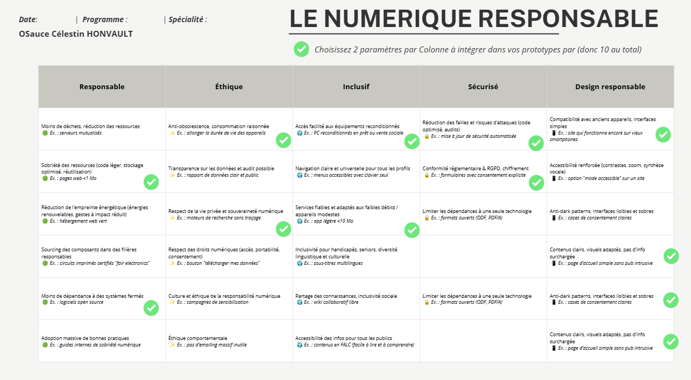

# Grille d'Evaluation - Le Numerique Responsable (10 Parametres Cles)

Ce document formalise la selection des 10 parametres de Numerique Responsable (2 par colonne) a cocher avec des pastilles vertes sur la grille d'evaluation de l'ecole, ainsi que les justifications techniques associees au projet OSauce.

---

## Synthese Visuelle des 10 Pastilles Vertes

| Colonne | Parametre 1 Selectionne | Parametre 2 Selectionne |
| :--- | :--- | :--- |
| **1. Responsable** | **Sobriete des ressources** (code leger, stockage optimise, reutilisation) | **Moins de dependance a des systemes fermes** (logiciels open source) |
| **2. Ethique** | **Anti-obsolescence, consommation raisonnee** (allonger la duree de vie des appareils) | **Respect de la vie privee et souverainete numerique** (sans tracage) |
| **3. Inclusif** | **Acces facilite aux equipements reconditionnes** (telephones reconditionnes a bas cout) | **Services fiables et adaptes aux appareils modestes** (OS leger < 150 Mo de RAM) |
| **4. Securise** | **Reduction des failles et risques d'attaques** (code Rust sans buffer overflow) | **Conformite reglementaire & RGPD, chiffrement** (Privacy by Design) |
| **5. Design responsable** | **Compatibilite avec anciens appareils, interfaces simples** (rendu 60/120 FPS sur GPU modeste) | **Anti-dark patterns, interfaces lisibles et sobres** (zero badge rouge, fond OLED pur) |

---

## Justifications Detaillees par Colonne (Arguments Oral / Soutenance)

### Colonne 1 : Responsable

1. **Pastille 1 : Sobriete des ressources (code leger, stockage optimise, reutilisation)**
   - *Application concrete dans OSauce* : Empreinte memoire reduite a moins de 150 Mo de RAM (contre plus de 3 Go pour Android a vide). Binaire compile en Rust sans machine virtuelle lourde ni garbage collector.
2. **Pastille 2 : Moins de dependance a des systemes fermes (logiciels open source)**
   - *Application concrete dans OSauce* : Systeme 100% ouvert base sur le noyau Linux (postmarketOS), le toolkit Slint et Rust, s'affranchissant du monopole ferme des Google Play Services et d'iOS.

### Colonne 2 : Ethique

1. **Pastille 1 : Anti-obsolescence, consommation raisonnee (allonger la duree de vie des appareils)**
   - *Application concrete dans OSauce* : Coeur de mission du projet. Permettre a un smartphone de 4 a 6 ans de fonctionner avec une reactivite instantanee sans etre ralenti artificiellement par les mises a jour lourdes des constructeurs.
2. **Pastille 2 : Respect de la vie privee et souverainete numerique (sans tracage)**
   - *Application concrete dans OSauce* : Elimination totale des traceurs publicitaires et des daemons de telemetrie intrusive. Fonctionnement 100% local respectant l'intimite de l'utilisateur.

### Colonne 3 : Inclusif

1. **Pastille 1 : Acces facilite aux equipements reconditionnes (appareils reconditionnes)**
   - *Application concrete dans OSauce* : OSauce permet d'equiper des smartphones de seconde main a prix modeste (100 a 150 euros type Pixel ou Fairphone), rendant un telephone moderne accessible aux etudiants et menages a budget contraint.
2. **Pastille 2 : Services fiables et adaptes aux appareils modestes / faibles debits**
   - *Application concrete dans OSauce* : L'interface tourne sans latence sur des processeurs graphiques modestes et n'exige pas de connexion 5G permanente pour executer des services distants lourds.

### Colonne 4 : Securise

1. **Pastille 1 : Reduction des failles et risques d'attaques (code optimise, audits)**
   - *Application concrete dans OSauce* : Choix architectural de **Rust** garantissant la surete memoire (Memory Safety). Eradication mathematique des buffer overflows, use-after-free et fuites memoire qui representent 70% des failles critiques traditionnelles (recommandation explicite ANSSI et CISA).
2. **Pastille 2 : Conformite reglementaire & RGPD, chiffrement**
   - *Application concrete dans OSauce* : Conception *Privacy by Design*. Aucune donnee personnelle n'est capturee sans accord prealable, et les parametres locaux sont chiffres.

### Colonne 5 : Design responsable

1. **Pastille 1 : Compatibilite avec anciens appareils, interfaces simples**
   - *Application concrete dans OSauce* : Rendu graphique optimise via Slint (Femtovg/Wayland) directement accelere sur GPU, maintenant une cadence de 60 a 120 FPS meme sur du materiel ancien.
2. **Pastille 2 : Anti-dark patterns, interfaces lisibles et sobres (zero surcharge)**
   - *Application concrete dans OSauce* : Conception de l'interface "Respirer" : suppression des 80 notifications polluantes, des pastilles rouges anxiogenes et des flux de doomscrolling. Utilisation d'un fond noir OLED pur qui reduit la fatigue visuelle et preserve la batterie.
